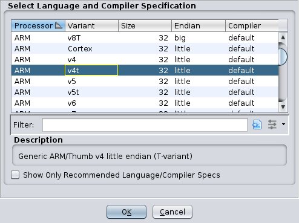
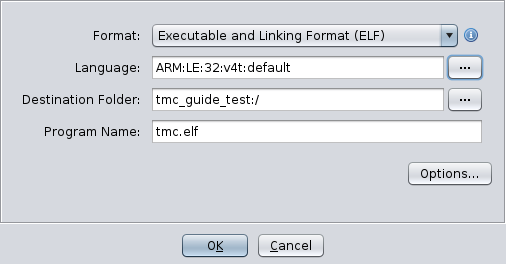

# Ghidra

## Create new project
<kbd>File | New Project...</kbd>

Import new file
`tmc.elf`
```
Processor: ARM
Variant: v4t
Size: 32
Endian: little
Compiler: default
```


Import using the format `Executable and Linking Format (ELF)`.  


Let it auto-analyze the file. (This takes a while).

## Import data types
Activate `Ghidra Bridge` plugin. Click on <kbd>Tools | Plugins | Export headers to Ghidra</kbd>.

Switch to Ghidra and click on
<kbd>File | Parse C Source...</kbd>.

Click on the <kbd>Clear profile</kbd> button in the top right.
In `Source files to parse` click on the <kbd>Display file chooser to select files to add</kbd> button. Navigate to the `tmp/ghidra_types` folder and select all files and click <kbd>OK</kbd>. Do the same for all files in the `gba` subfolder.

Click on <kbd>Parse to Program</kbd>.
Click on <kbd>Continue?</kbd> in the `Use Open Archives?` dialog.

In the `Data Type Manager` dock right click on `tmc.elf` and select <kbd>Apply Function Data Types</kbd>.

## Create bridge script
<kbd>Window | Script Manager</kbd>
Click on <kbd>Create New Script</kbd> button in the top right.
Select `Java` script type.

Copy contents of `the-little-hat/plugins/cexplore_bridge/CExploreBridge.java`.

Or directly create a symlink from the `ghidra_scripts` directory.